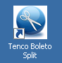
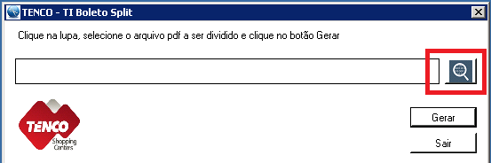
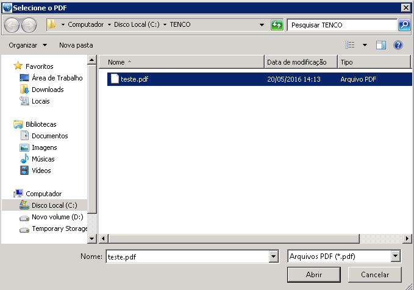
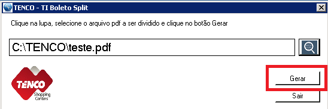

Title: Desmembramento de Boletos - Versão 1.0 05/2016

---

Neste documento vamos aprender a utilizar o software para desmembramentos de boletos criado pela TI da TENCO.
É um processo simples, de fácil entendimento e utilização e que trará muitos benefícios no que tange ao tempo de trabalho para entrega dos boletos. 
  
Vamos lá?

----------

**A) Localize o ícone em sua área de trabalho!** 

	- Para executar o sistema clique no ícone simular ao demonstrado abaixo.
 

> ### Como Fazer ###
> Após o sistema iniciar, será apresentada a tela abaixo. Clique na Lupa em destaque para selecionar o arquivo PDF as ser dividido:

 
> Selecione o arquivo PDF a ser dividido e clique em Abrir. 

> Agora após ter selecionado o boleto basta clicar em Gerar.  

 
**Um arquivo zipado chamado boletos será gerado em sua área de trabalho.** 

> [help] 
> 
> Caso ainda existam dúvidas sinta-se à vontade em procurar a equipe de TI. 
> Nosso e-mail para contato é <ti@grupotenco.com.br>
> 