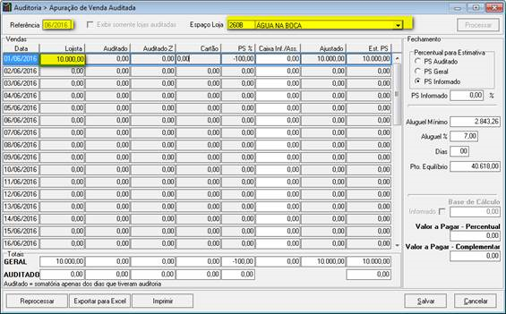
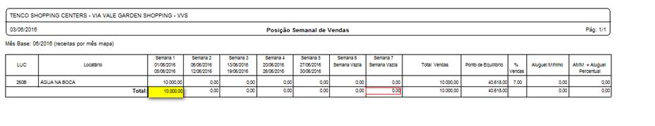
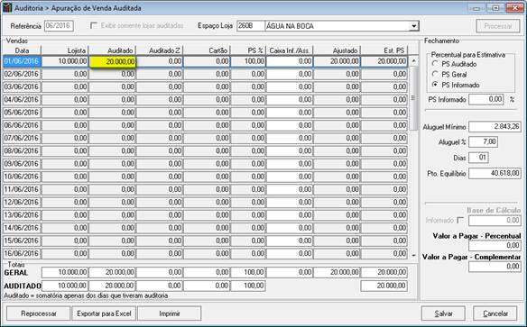
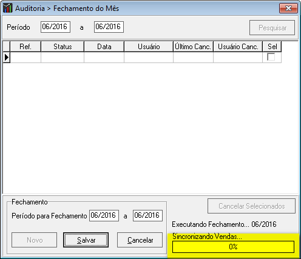
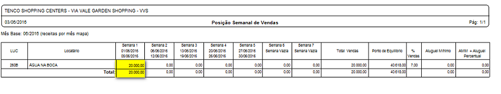

Title: Fechamento de Vendas e Sincronização com GShop - Versão 1.0 06/2016

---

Neste documento vamos aprender a efetuar o fechamento de vendas no GQUEST e para que sejam sincronizadas automaticamente no GShop.

É um processo simples, de fácil entendimento e utilização e que trará muitos benefícios no que tange ao tempo de trabalho de apuração de vendas. 
  
Vamos lá?

----------

Vamos simular um caso em que foi informada uma venda de R$10.000,00 e a mesma venda foi auditada com o valor de R$20.000,00. 

Note na imagem abaixo que a coluna Lojista apresenta o valor informado de R$10.000,00 

No Gshop, o relatório de vendas também apresenta o mesmo valor. 

 
Porém, após auditoria, descobriu-se que o valor correto era R$20.000,00 e este valor foi informado na coluna Auditado. 

Para sincronizar os novos valores com o Gshop no momento da apuração das vendas, siga os passos abaixo: 

> ### Como Fazer ###
**- No GQUEST acesse a tela de Fechamento do Mês ** 

	- Clique em novo e informe o período para fechamento.  
	- Após clicar em salvar o sistema automaticamente fará a sincronia das vendas. 
	
 

Após este procedimento as vendas serão lançadas automaticamente no GShop. 

> [help] 
> 
> Caso ainda existam dúvidas sinta-se à vontade em procurar a equipe de TI. 
> Nosso e-mail para contato é <ti@grupotenco.com.br>
> 