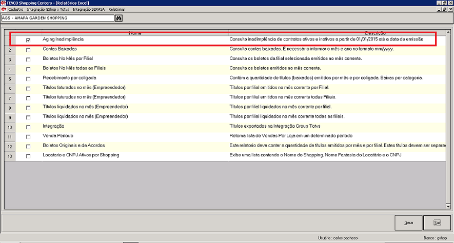

Title: Relatórios Excel - Aging Inadimplência - Versão 1.0 03/2016

---

Neste documento vamos aprender a emitir o Relatório Aging de Inadimplência bem como os demais relatórios em excel disponibilizados no sistema. 

1 - Acesse o sistema TENCO. 

Acesse o menu (Relatórios/Relatórios em Excel); 

Será apresentada a tela abaixo com as consultas disponíveis.

  

2 - Marque o quadro ao lado da consulta "Aging Inadimplência". 

3 - Clique no botão Gerar.

Será criada uma planilha Excel contendo o relatório solicitado. 

> [help] 
> 
> Caso ainda existam dúvidas sinta-se à vontade em procurar a equipe de TI. 
> Nosso e-mail para contato é <ti@grupotenco.com.br>
> 